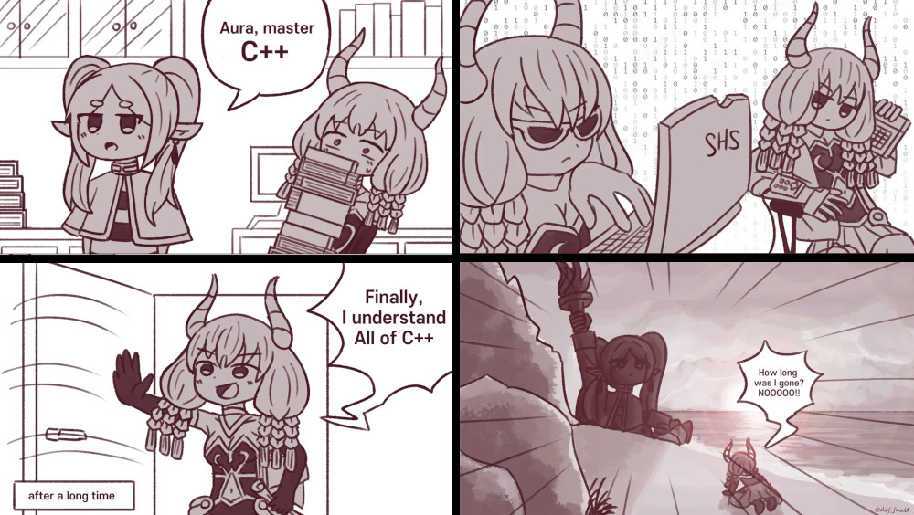

# C++ Modules (42 Barcelona)

**These modules are made to learn C++ syntax and Object-oriented programming concept and best practices. These modules stick to the C++98 standards.**
- **Location:** 42 School Barcelona
- **Validation:** June 2025
 

## Modules 

### Module 00 *(12 hours)*

**Subject:** [English](module00/subject/en.subject.pdf) / [French](module00/subject/fr.subject.pdf)

**Concepts** ([intra videos](https://elearning.intra.42.fr/notions/piscine-c-d00-c-basics/subnotions)):
- namespaces
- classes
- member functions
- `stdio` streams
- initialization lists
- `static`
- `const`
- and some other basics

### Module 01 *(12 hours)*

**Subject:** [English](module01/subject/en.subject.pdf)

**Concepts** ([intra videos](https://elearning.intra.42.fr/notions/piscine-c-d01-c-basics-2/subnotions)):
- Memory allocation
- pointers to members
- references
- switch statements

### Module 02 (12 hours)

**Subject:** [English](module02/subject/en.subject.pdf) / [French](module02/subject/fr.subject.pdf)

**Concepts** ([intra videos](https://elearning.intra.42.fr/notions/piscine-c-d02-93e8d707-f883-4f82-928b-cbc45a162079/subnotions)):
- ad-hoc polymorphism
- operator overloading
- the Orthodox Canonical class form

### Module 03 *(12 hours)*

**Subject:** [English](module03/subject/en.subject.pdf)

**Concepts** ([intra videos](https://elearning.intra.42.fr/notions/piscine-c-d03-inheritance/subnotions)):
- inheritance

### Module 04 *(12 hours)*

**Subject:** [English](module04/subject/en.subject.pdf) / [French](module04/subject/fr.subject.pdf)

**Concepts** ([intra videos](https://elearning.intra.42.fr/notions/piscine-c-d04-sub-typing-polymorphism/subnotions)):
- subtype polymorphism
- abstract classes
- interfaces

## Rules

### Compilation

- Compile with c++ -Wall -Wextra -Werror.
- Must work with -std=c++98 (no C++11+).
- Example: **`c++ -Wall -Wextra -Werror -std=c++98 myfile.cpp -o myprogram`**

### Code Style

- **Class names:** `UpperCamelCase` (e.g., `ClassName`).
- **Files:** Match class name (e.g., `ClassName.hpp`, `ClassName.cpp`).
- **Output:** Messages must end with `\n` and go to `std::cout`.

### Constraints

**Allowed:**
- C++ versions of C functions (e.g., `<iostream>` instead of `<stdio.h>`).
- STL (`containers`, `algorithms`) only in Modules 08 & 09.

**Forbidden:**
- Libraries: No `C++11`, `Boost`, or external libs.
- Functions: `*printf()`, `*alloc()`, `free()`
- Keywords: using `namespace` & `friend` (unless allowed)

### Design Requirements

- **No memory leaks:** Always delete what you `new`.
- **Orthodox Canonical Form** (only for Modules 02–09):
	- Default constructor
	- Copy constructor
	- Copy assignment operator
	- Destructor
- **Headers:** Must have include guards & stand-alone dependencies.

### Additional Notes

- No enforced coding style, but keep it clean.
- Exercise examples may imply hidden requirements.
- Split code into extra files if needed.